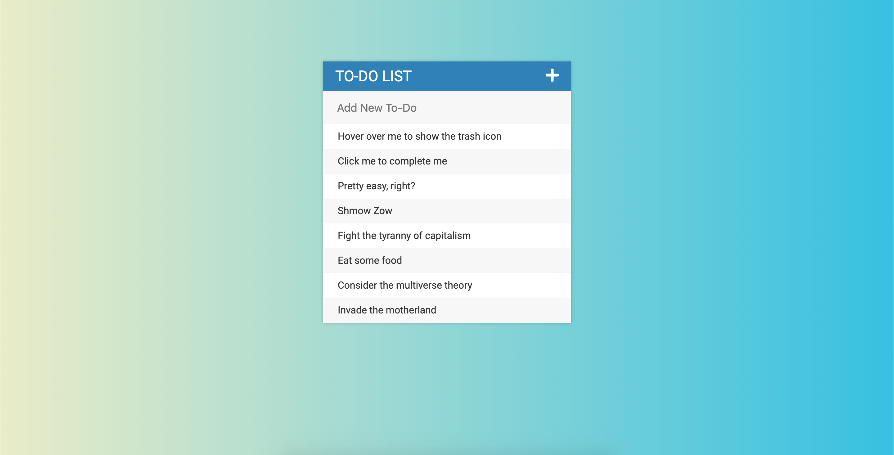

# BASIC TO-DO LIST
## About
This project is a basic to-do list the operates using HTML and CSS for the presentation and jQuery for the logic.

## Set up
- Pull this repo from Github
- Run todo.html in a browser
- Interact with page

## Use instructions
- Hover over an element to either:
    - Click it to complete it 
    - Show the trash that can be used to delete that task
- Click the plus sign to toggle the text input
    - Type your new todo and hit enter to add it to your list

## Todo
- Done!